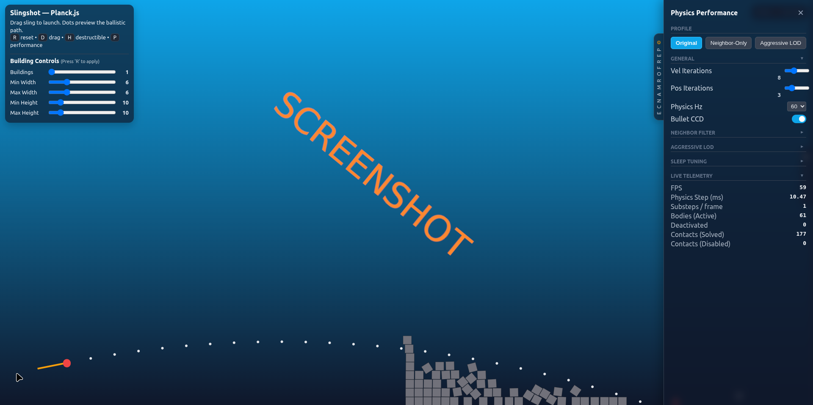

# js_city_slingshot

# Slingshot Performance Demo — Planck.js

A browser-based **slingshot + destructible buildings** sandbox that doubles as a **physics performance lab**.  
Built with [Planck.js](https://github.com/shakiba/planck.js) (Box2D port). Tune solver iterations, apply **neighbor-based contact filtering**, try **aggressive LOD/deactivation**, toggle **CCD bullets**, and watch **live telemetry** update in real time.

## Screenshots


> **Tech:** HTML5 Canvas (2D), vanilla JS, Planck.js via CDN. Works on desktop & mobile (mouse/touch).

---

## ✨ Highlights

- 🎯 **Slingshot gameplay** — drag to aim, dots preview the ballistic arc, release to fire.
- 🧱 **Destructible buildings** — blocks take damage from contact impulses and break apart.
- ⚙️ **Performance panel (P)** — switch between **Original / Neighbor‑Only / Aggressive LOD** profiles.
- 🧩 **Spatial Hash broad‑filter** — disables far/irrelevant dynamic‑dynamic contacts before solving.
- 💤 **Aggressive LOD** — auto‑deactivate far‑away bodies; reactivate when camera approaches.
- 🚀 **CCD for bullets** — avoid tunneling by enabling Continuous Collision Detection for the projectile.
- 🌬️ **Toggle air drag (D)** — test the difference in projectile behavior with/without drag.
- 📈 **Live telemetry** — FPS, step time (avg & p95), substeps, bodies active/deactivated, contacts, etc.
- 🧪 **Detailed telemetry panel** — per‑second churn (wakeups/s, sleepdowns/s), impulse stats, counts.
- 🖱️ **Responsive & touch‑friendly** — drag on canvas; UI sliders for world generation.
- 🧰 **Self‑contained** — single `index.html` + `style.css` + `script.js` with Planck.js from CDN.

---

## 🎮 Controls

**Mouse/Touch**  
- **Launch:** click/touch & drag from the brown sling on the left; release to fire.  
- **Aiming:** white dots preview the ballistic path.

**Keyboard**  
- **R** — Reset scene (applies building sliders)  
- **D** — Toggle air drag on the projectile  
- **H** — Toggle **destructible mode** (blocks take damage / break)  
- **P** — Open/close the **Performance** panel  
- **Details handle** — Open/close the **Detailed Telemetry** panel

---

## 🧱 Building Controls (left panel)

After changing sliders, press **R** to rebuild with the new settings:

- **Buildings:** `1–10`  
- **Min/Max Width (blocks):** `3–15` each  
- **Min/Max Height (blocks):** `5–40` each

Blocks are 0.4×0.4 m boxes stacked into buildings across the right half of the screen.

---

## 🧪 Performance Panel (P)

Switch **profiles** quickly:
- **Original** — Default Box2D‑like behavior, CCD on bullets.  
- **Neighbor‑Only** — Enables the spatial hash neighbor filter to disable distant contacts.  
- **Aggressive LOD** — Lower iterations / Hz, neighbor filter **and** dynamic body deactivation at distance.

**Tunables** (some reflect current profile):
- **General:** `velocityIterations`, `positionIterations`, `Physics Hz`, `Bullet CCD`  
- **Neighbor Filter:** `Enable Filter`, `Grid Cell Size (m)`, `Neighbor Radius` (cells)  
- **Aggressive LOD:** `Enable LOD`, `Max Active Dist (m)`, `Reactivate Margin (m)`  
- **Sleep Tuning:** `Allow Sleep`, `Time to Sleep`, `Linear/Angular Tolerance`  
  - _Note: some sleep sliders are greyed when not runtime‑configurable in Planck.js._

**Live telemetry (top of panel):** FPS, physics step (ms), substeps/frame, bodies active, deactivated, contacts solved/disabled.

---

## 📊 Detailed Telemetry Panel

Open using the **Details** vertical tab. Shows rolling stats updated ~4×/s:
- **WORLD / STEP:** step time ms (avg & p95), target Hz, dt, substeps, accumulator, budget‑hit indicator.
- **BODIES / FIXTURES:** totals, dynamic/awake/sleeping, sleep ratio, fixtures, joints, **bullets**.
- **COLLISION:** active contacts, new/destroyed per second.
- **SLEEP / CHURN:** wakeups/s, sleepdowns/s, awake ratio.
- **CONTACT IMPULSES:** average & p95 normal impulse; **damage events/s** over a threshold.

---

## 🧠 How it Works (short)

- **SpatialHashGrid** (uniform grid) tags dynamic bodies into cells each step. During `pre-solve`, if two dynamic bodies aren’t within the configured **neighbor radius** of cells, their contact is **disabled** (`contact.setEnabled(false)`). This reduces narrow‑phase work.
- **Aggressive LOD** deactivates sleeping dynamic bodies that are **far from the camera** (`body.setActive(false)`), and reactivates them when the camera approaches (with a margin to avoid thrashing).
- **Damage model**: on `post-solve`, if a projectile‑block contact’s **normal impulse** exceeds a threshold (default `3.0`), the block’s health gets reduced and it is destroyed when ≤0.
- **Fixed‑timestep loop**: accumulator‑based substepping at `hz` (profile dependent), capped substeps per frame.

---

## 🚀 Quick Start

1. **Clone or copy** the three files to a folder:
   - `index.html`
   - `style.css`
   - `script.js` (the long JS block you pasted above)
2. Open `index.html` in a modern browser (Chrome/Edge/Firefox).  
   Planck.js is loaded via CDN:  
   ```html
   <script src="https://cdn.jsdelivr.net/npm/planck-js@0.2.7/dist/planck.min.js"></script>
   ```

### Local static server (optional but recommended)
```bash
# Python 3
python -m http.server 8000
# then visit http://localhost:8000
```

### Deploy to GitHub Pages
1. Push the three files to the root of your repo (or `/docs`).
2. In your repo: **Settings → Pages → Source** = `main` branch (root or `/docs`).  
3. Open your Pages URL to play.

### Deploy to itch.io (optional)
- Create a new HTML5 project, upload the three files (or a ZIP).  
- Mark as **This file will be played in the browser**.

---

## 🗂️ File Structure

```
/ (project root)
├─ index.html     # Canvas, UI panels, Planck.js CDN, script include
├─ style.css      # Glassy UI, panels, sliders, telemetry layout
└─ script.js      # World setup, slingshot, damage, spatial hash, profiling
```

---

## 🔧 Key Constants & Hooks (in `script.js`)

```js
const DAMAGE_IMPULSE_THRESHOLD = 3.0; // contact impulse threshold to count as damage
const APP = {
  PPM: 50,                 // pixels per meter for rendering
  camera: { pos: Vec2(15, 8) }, // used by LOD distance checks
  buildingSettings: {      // sliders map here
    numBuildings: 1, minWidth: 6, maxWidth: 6, minHeight: 10, maxHeight: 10
  }
};
// World gravity is set by: new pl.World(Vec2(0, -10));
```

**Performance profiles** (editable in `PhysicsManager.getProfile(name)`):
- `velocityIterations`, `positionIterations`, `hz`
- `enableCCDForBullets`
- `enableNeighborFilter`, `gridCellSize`, `neighborRadiusCells`
- `enableDeactivation`, `maxActiveDistance`, `reactivateMargin`
- `allowSleep`, `timeToSleep`, `linearSleepTolerance`, `angularSleepTolerance`
  - (_Some sleep parameters are compile‑time / not fully runtime in Planck.js; UI greys them when not supported_.)

---

## 🧩 Known Limitations / Notes

- **CCD** in Planck.js applies to bodies flagged as `bullet` (only the projectile here).  
- **Sleep tuning** sliders are present for parity, but full runtime control varies in Planck.js.
- The **neighbor filter** only disables **dynamic–dynamic** contacts; static interactions stay enabled.
- The canvas uses device‑pixel‑ratio scaling for crisp rendering.
- Long sessions with very large stacks can create garbage pressure; reload to clear if needed.

---

## 🛠️ Troubleshooting

- **Nothing happens when I drag?** Ensure you’re dragging **from the sling** area (left). Try resetting with **R**.
- **Blocks don’t break.** Check **H** (destructible mode) is enabled. Increase launch power.
- **Performance dips / budget hit turns red.** Switch to **Neighbor‑Only** or **Aggressive LOD**, lower `Hz`, or reduce building size.
- **Mobile:** If touch scrolling interferes, ensure the page is focused and drag on the canvas itself.

---

## 🗺️ Roadmap Ideas

- Multiple projectile types (heavy/fast, sticky, explosive)
- Camera follow / cinematic replay
- Save/load seeds for building generation
- Per‑material damage thresholds & fracture visuals
- Toggleable terrain and moving targets
- Export telemetry to CSV for offline analysis

---

## 📜 License

MIT — do what you want, attribution appreciated.  
Includes [Planck.js](https://github.com/shakiba/planck.js) under its license.

---

## 🙌 Credits

- Physics: **Planck.js** by Ahmad Shakiba  
- Design & code: **Pemmyz** (this project)
